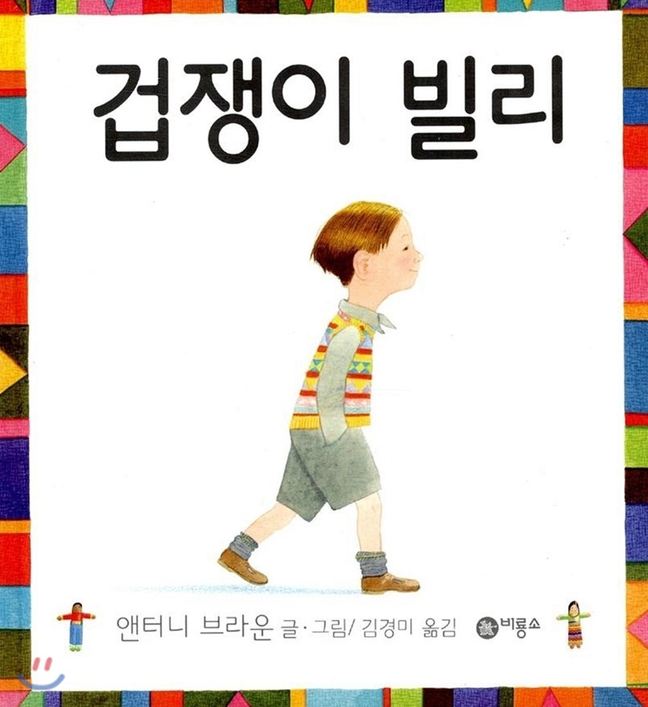

  

1. 주인공 이름은?
> 빌리
2. 빌리의 성격은?
> 걱정이 많은 아이
3. 무엇 때문에 걱정했나?
> 모자, 신발, 구름, 비, 커다란 새
4. 아빠는 뭐라 했나?
> "걱정 마라, 얘야. 그런 일은 절대 일어날 수 없단다. 다 네 상상일 뿐이야."
5. 엄마는 뭐라 했나?
> "걱정 마라, 아가야. 무슨 일이 있더라도 엄마 아빠가 널 꼭 지켜 줄 거야."

---
6. 빌리는 어디에 갔나?
> 할머니 댁
7. 빌리는 언제 걱정이 더 많아지나?
> 다른 집에서 자게 될 때
8. 겁이난 빌리는 어떻게 했나?
> 침대에서 일어나 할머니께 말씀드리러 감
9. 할머니는 어떻게 했나?
> 걱정 인형을 주면서 인형들에게 걱정을 한 가지씩 이야기하고 배게에 넣어두면, 자는 동안 그 인형들이 대신 걱정을 해 줄거라고 하심
10. 그래서?
> 빌리는 걱정 인형들에게 온갖 걱정을 다 얘기하고 곤히 잠들었다
11. 집에 돌아와서는?
> 집에서도 모든 걱정을 인형에게 얘기하고 깊이깊이 잠들고, 다음 날도, 그다음 날도!

---
12. 그런데 왜 빌리는 또 걱정을 하기 시작했나?
> 불쌍한 인현들에게 걱정거리들을 다 떠넘겨서 그 애들이 걱정됨
13. 그래서 빌리는 어떻게 했나?
> 좋은 생각을 해내고는, 하루 종일 넓은 식탁에서 일을 해서 아주 특별한 것을 만들어 냄
14. 그게 뭔데?
> 걱정 인형들을 위한 또 다른 걱정 인형!
15. 그래서 잠은 잘잤나?
> 빌리와 빌리의 걱정 인형들은 모두 모두 새근새근 잠이 들었음

---
16. 그 후로 빌리는 어떻게 됐어?
> 그다지 많이 걱정을 하지 않았음. 인형도.
17. 인형들은 왜?
> 빌리가 모두에게 걱정 인형을 만들어 주었기 때문

---
18. 걱정인형은 어느 나라에서 처음 생겼나?
> 중앙아메리카의 과테말라
19. 무엇을 만들지?
> 아주 작은 나무 조각과 남은 천 조각 등으로
