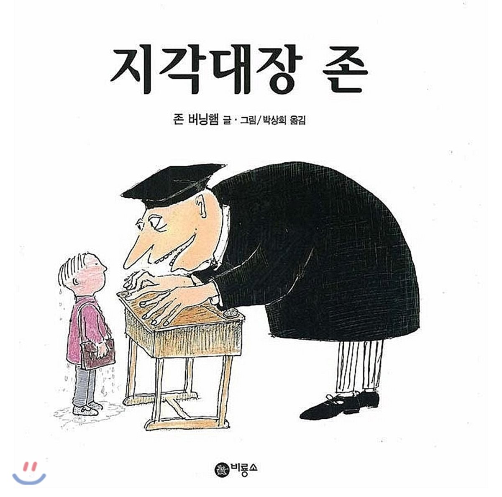

  

1. 주인공 이름은?
> 존 패트릭 노먼 맥헤너시
2. 어디를 가려고 했나?
> 학교
3. 어디에서 나갔나?
> 집
4. 하수구에서 나온 것은 무엇이고, 무엇을 물었나?
> 악어, 책가방
5. 존은 무엇을 던졌을까?
> 장갑 하나
6. 지각해서 받은 벌은?
> '악어가 나온다는 거짓말을 하지 않겠습니다. 또 다시는 장갑을 잃어버리지 않겠습니다.'를 300번 쓰기

---
7. 다음에 학교 갈 때 나온 것은? 무엇을 물어뜯었나?
> 사자, 바지
8. 사자를 피한 곳은?
> 나무 위
9. 지각해서 받은 벌은?
> '다시는 사자가 나온다는 거짓말을 하지 않겠습니다. 그리고, 다시는 바지를 찢지 않겠습니다.'를 큰 소리로 400번 외치기

---
10. 다음에 학교 갈 때는?
> 다리를 건너는데, 갑자가 커다란 파도가 밀려옴
11. 어떻게 했나?
> 난간을 꼭 붙잡고 매달려 있었음
12. 지각해서 받은 벌은?
> '다시는 강에서 파도가 덮쳤다는 거짓말을 하지 않겠습니다. 그리고, 다시는 옷을 적시지도 않겠습니다.' 를 500번 쓰기.

---
13. 제 시간에 도착하니 무슨 일이 있었나?
> 선생님이 털복숭이 고릴라한테 붙들려 천장에 매달려 있었음
14. 그러자 존은?
> "이 동네 천장에 커다란 털복숭이 고릴라 따위는 살지 않아요, 선생님"
